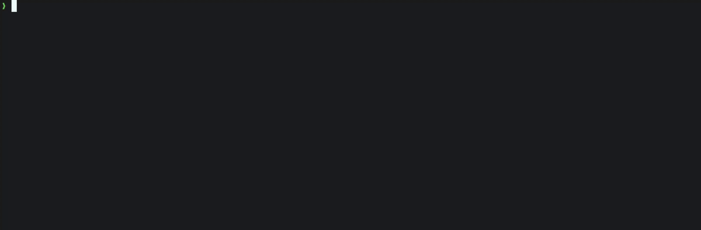

# Greenlight

**A modern, parallel-first test framework for PHP 8.4+.**

Greenlight is built for PHP teams that want faster feedback, stronger isolation, and reliable CI output without adding a heavy dependency stack to the application under test.

It runs suites in parallel by default, keeps memory usage stable across long runs, isolates risky tests when needed, captures output per test, and produces deterministic reports for local terminals and CI systems.

**Status: pre-release. Feature-complete and self-hosted; no version tag yet and not published to Packagist.**

Greenlight already tests itself. This repository's suite runs under its own `bin/greenlight run` across an auto-sized worker pool.



## Why Greenlight?

PHP test suites tend to get slower as they grow. They also get harder to trust when state leaks between tests, CI logs are noisy, worker memory creeps upward, or failures only reproduce on one machine.

Greenlight is designed around those problems from the runner upward.

A normal run uses a parallel worker pool. Work is distributed dynamically, so slow classes do not block idle workers. Workers can recycle by test count or memory ceiling. Tests can be isolated when they need a clean process. Output is captured per test, so stray stdout, warnings, notices, and diagnostics do not corrupt the report stream.

The result is a test runner that is quick locally, predictable in CI, and comfortable on large suites.

## What Greenlight gives you

* **Parallel by default** with an auto-sized worker pool.
* **Stable memory usage** over long suites through worker recycling and leak detection.
* **Process isolation** for tests or classes that need clean state.
* **Deterministic CI output** with plain, JUnit, JSONL, GitHub, and TeamCity reporters.
* **Reproducible ordering** with seeded randomisation.
* **Failed-first workflows** with `--failed` and watch mode.
* **Coverage gates** through pcov or Xdebug.
* **Strict test doubles** that fail on unplanned or unverified behaviour.
* **Typed expectations** with rendered diffs.
* **Plain PHP test code** using attributes, typed classes, constructor injection, and PHP configuration.
* **Zero runtime dependencies**, so the framework does not version-conflict with the code under test.

## What a test looks like

```php
<?php

declare(strict_types=1);

namespace App\Tests;

use Greenlight\Attribute\DataRow;
use Greenlight\Attribute\Test;
use Greenlight\Expect\Expect;

final class PriceTest
{
    #[Test]
    #[DataRow(['9.99', 2, '19.98'], label: 'two units')]
    #[DataRow(['0.50', 3, '1.50'], label: 'three small units')]
    public function multipliesLineTotals(string $unit, int $quantity, string $expected): void
    {
        $total = Price::fromString($unit)->times($quantity);

        Expect::that($total->format())->toBe($expected);
    }

    #[Test]
    public function rejectsNegativeQuantities(): void
    {
        Expect::that(static function (): void {
            Price::fromString('9.99')->times(-1);
        })->toThrow(\InvalidArgumentException::class, matching: '/quantity/');
    }
}
```

Greenlight tests are normal typed PHP classes. Attributes mark tests and data rows. Assertions start from `Expect::that()`. Constructor injection provides stateful services such as fixtures, test doubles, and plugin-provided harness services.

That shape keeps test code explicit, analysable, and easy to refactor with standard PHP tooling.

## Configuration

Configuration is a PHP file at the project root. It can be reviewed, refactored, and checked by PHPStan like the rest of the codebase.

```php
<?php

declare(strict_types=1);

use Greenlight\Config\GreenlightConfig;

return GreenlightConfig::create()
    ->paths(['tests'])
    ->workers(count: 'auto');
```

The same fluent API covers the rest of the runner: `suite()` declares named suites with per-suite filtering, `coverage()` selects a driver and export formats, `watch()` tunes the watch-mode debounce, `randomizeOrder()` opts into seeded random ordering, `failFast()` stops the run on first failure, and `ignoreDeprecationsMatching()` exempts known dependency deprecations from `failOnDeprecation()`. The full surface is in the [configuration reference](docs/configuration.md).

Run the suite:

```bash
$ vendor/bin/greenlight run

Greenlight dev-main | PHP 8.4.14 | config: greenlight.php | workers: 11

3 tests, 3 passed, 3 expectations
Time: 0.110s
Workers: 1 spawned
```

While the run is in flight, an interactive terminal shows a live progress window with per-worker class activity; `--verbose` keeps a permanent line per completed class. In CI, the plain reporter emits deterministic append-only output with one line per test:

```
PASS App\Tests\PriceTest::multipliesLineTotals[two units] (0.001s)
PASS App\Tests\PriceTest::multipliesLineTotals[three small units] (0.000s)
PASS App\Tests\PriceTest::rejectsNegativeQuantities (0.000s)
```

Reporters are repeatable, so a run can emit terminal output, JUnit, and JSONL from the same execution: `--reporter=plain --reporter=junit --reporter=jsonl`.

## Parallel execution

Greenlight treats parallel execution as the default path.

Tests run across a worker pool sized to the machine. Workers pull work on demand, which keeps the pool busy when one class is slower than the rest. Sequential execution is available with `--workers=1`, using the same execution path, which makes debugger sessions straightforward.

Worker recycling keeps long suites healthy. A worker can be recycled after a test count threshold or a memory ceiling. CI gates a 10,000-test single-worker run at under 1 MiB of memory drift, and `--detect-leaks` names any test whose instance survives collection.

## Isolation

Some tests need a clean process. Greenlight runs tests marked `#[Isolated]` in a fresh process without forcing the entire suite into the slowest mode.

Use isolation when a test mutates global state, touches process-wide configuration, exercises shutdown behaviour, or loads code that cannot be safely unloaded. The rest of the suite can continue to run in the normal worker pool.

That lets large suites stay fast while still giving dangerous tests the boundary they need.

## Fast, with published trade-offs

On [generated benchmark suites](docs/benchmarks.md), Greenlight's best configuration beats PHPUnit's best by 2.5x to 7x. Most of the margin comes from lower runner overhead per test, not only from parallel execution.

The benchmark documentation also includes the cases where parallelism loses. On trivial test bodies, worker spawn can cost more than the work being performed, so one worker wins.

Real suites usually do real work. Database calls, filesystem setup, container bootstrapping, HTTP clients, serializers, validators, service containers, and application code all give the worker pool useful work to overlap.

Reproduce the numbers with:

```bash
php tools/benchmark.php --with-phpunit
```

CI smoke-runs the benchmark harness so the tooling keeps working; the published numbers come from full local runs.

## Strict test doubles

Greenlight's test doubles are designed to catch accidental gaps in verification.

Tests receive a per-test `Doubles` service through constructor injection and create doubles with `mock()`, `stub()`, and `spy()`.

Mocks answer only planned interactions. Stubs satisfy a type and error on unexpected interaction. Spies record void-returning calls. Every double is verified when its test ends, and an unmet plan is reported like an assertion failure.

The runner also flags passed tests that verified nothing as risky. `--fail-on-risky` upgrades risky tests to failures. `#[NoExpectations]` records the deliberate cases where a test legitimately asserts nothing.

## Writing tests

Greenlight includes attributes for the full test lifecycle:

* `#[Test]`
* `#[Before]`
* `#[After]`
* `#[Group]`
* `#[Skip]`
* `#[SkipUnless]`
* `#[Retry]`
* `#[Timeout]`
* `#[Isolated]`

Data-driven tests are expanded at plan time through provider methods and inline rows:

* `#[DataSet]`
* `#[DataRow]`

Named data keys appear in every report, which makes failures easier to identify.

Expectations use a fluent typed chain:

```php
Expect::that($value)->toBe($expected);
Expect::that($items)->toHaveCount(3);
Expect::that($callback)->toThrow(RuntimeException::class);
Expect::that($result)->not()->toBeNull();
```

Failed expectations throw immediately with a rendered diff.

Harness services can be scoped per test, class, suite, or run. Expensive fixtures are built lazily and disposed in reverse order.

## Running tests

Greenlight includes the controls needed for local development and CI:

* `--filter` for name patterns.
* `--group` for tagged subsets.
* `--failed` to re-run the previous run's failures.
* `--bail[=n]` to stop after the first (or nth) failure.
* `--shard=n/m` to split a suite across CI machines without coordination.
* `--seed=N` to reproduce randomized order exactly.
* `--workers=N` to control parallelism; `--workers=1` runs sequentially for debugging.
* `--reporter=<name>` to select output, repeatable to emit several formats at once.
* `--watch` for debounced re-runs with failed-first ordering.
* `--config=<path>` to run against a config file other than `./greenlight.php`.
* `--dry-run` to print the resolved configuration without executing.

`--no-ansi` disables colours and the live progress window, and `--verbose` prints a permanent line per completed class. The `list-tests` command prints every discovered test id, one per line, for tooling and shard debugging.

Per-test output capture keeps stdout and PHP diagnostics attached to the result that produced them.

## Profiling

`--profile` appends runner performance information after the summary, including worker utilisation, boot latency, and the slowest classes.

`profile:report` can reproduce the profiling block offline from a saved artifact. That makes it easier to compare runs without keeping the original process output around.

## CI and reporting

Greenlight has one event stream and multiple reporters:

* `tty`
* `plain`
* `junit`
* `jsonl`
* `github`
* `teamcity`

Use the TTY reporter locally. Use append-only plain output for CI logs. Emit JUnit for dashboards. Stream JSONL for custom tooling. Add GitHub or TeamCity annotations when the CI system supports them.

CI gates include:

* `--fail-on-deprecation`
* `--fail-on-notice`
* `ignoreDeprecationsMatching()` to exempt known dependency deprecations
* coverage through pcov or Xdebug
* `coverage:diff` for regression gating

Coverage export formats:

* json
* lcov
* clover
* cobertura
* html

Exit codes are deterministic: 0 for success, 1 for any failure, 64 for usage errors. A run that discovers zero tests exits 1 as a misconfiguration.

## Extending Greenlight

Plugins receive live runtime context:

* the actual test instance
* test metadata
* harness services

Extension points include per-test lifecycle subscribers, run-level event subscribers, retry deciders, harness providers, service resolvers, custom expectation matchers, and custom reporters.

Custom expectation matchers stay statically checked. The bundled PHPStan extension reads the Greenlight config and fails analysis on matcher name typos or wrong arguments; enable it by including the package's `extension.neon` in your PHPStan configuration. The `ide-helper` command generates autocomplete support with real signatures.

The `completion` command prints shell completion scripts for:

* bash
* zsh
* fish

## Requirements

Greenlight requires PHP 8.4 or later.

Lazy objects, property hooks, and asymmetric visibility are load-bearing parts of the design, so older runtimes are not supported.

The parallel runner uses core stream sockets and `proc_open`. It does not require an extension.

Coverage requires one of:

* `ext-pcov`
* Xdebug

## Documentation

* [Getting started](docs/getting-started.md)
* [Configuration reference](docs/configuration.md)
* [Attribute reference](docs/attributes.md)
* [Writing plugins](docs/plugins.md)
* [Testing Symfony applications](docs/symfony.md)
* [Migrating from PHPUnit](docs/migrating-from-phpunit.md)
* [Benchmarks](docs/benchmarks.md)
* [JSONL reporter schema](docs/architecture/jsonl.md)
* [Coverage JSON schema](docs/architecture/coverage-json.md)
* [Code conventions](docs/architecture/conventions.md)
* [Contributing guide](CONTRIBUTING.md)

## License

MIT. See [LICENSE](LICENSE).
