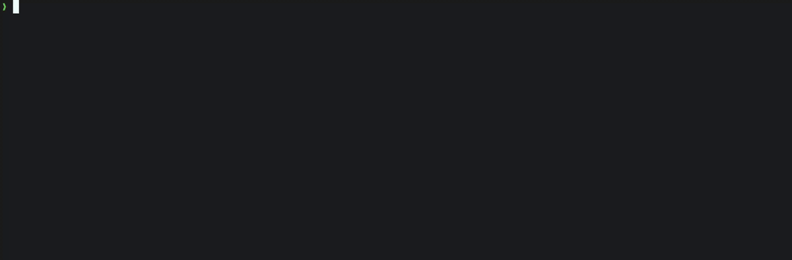

# <a href="https://ben-challis.github.io/greenlight/"></a>

[](https://github.com/ben-challis/greenlight/actions/workflows/ci.yml)
[](https://app.codecov.io/gh/ben-challis/greenlight)
[](https://securityscorecards.dev/viewer/?uri=github.com/ben-challis/greenlight)
[](composer.json)
[](LICENSE)

**A parallel-first test framework for PHP 8.4 and later.**

Greenlight runs test classes in parallel by default and has zero runtime
dependencies. Greenlight discovers tests in the configured paths and sends
class assignments to a pool of worker processes.

[Read the documentation](https://ben-challis.github.io/greenlight/)

Greenlight runs its own test suite with `bin/greenlight run`.



## Capabilities

* Parallel test execution with a dynamic schedule
* Run-scoped integration fixtures with per-channel resources
* Resource limits for shared databases and services
* Leak detection, crash recovery, timeouts, and process isolation
* Strict mocks, stubs, and spies with automatic verification
* Typed expectations with clear differences
* Stable CI shards and deterministic reports
* Test attachments for values, text, bytes, and files
* Coverage through pcov or Xdebug
* Plain PHP test classes and PHP configuration
* First-party Symfony, Laravel, Hyperf, PSR-11, PSR-15, Tempest, and PHPStan adapters
* Automated PHPUnit test conversion with a bundled Rector rule

## Example test

<!-- php-example {"example":"readme-example-01","file":"snippet.php","mode":"file","tools":["rector"]} -->
```php
<?php

declare(strict_types=1);

namespace App\Tests;

use Greenlight\Attribute\DataRow;
use Greenlight\Attribute\Test;
use Greenlight\Expect\Expect;

final class PriceTest
{
    #[Test]
    #[DataRow(['9.99', 2, '19.98'], label: 'two units')]
    #[DataRow(['0.50', 3, '1.50'], label: 'three small units')]
    public function multipliesLineTotals(string $unit, int $quantity, string $expected): void
    {
        $total = Price::fromString($unit)->times($quantity);

        Expect::that($total->format())->toBe($expected);
    }

    #[Test]
    public function rejectsNegativeQuantities(): void
    {
        Expect::that(static function (): void {
            Price::fromString('9.99')->times(-1);
        })->toThrow(\InvalidArgumentException::class, matching: '/quantity/');
    }
}
```

Tests use typed PHP classes. Attributes identify tests, before and after
methods, data sets, retries, timeouts, skip conditions, groups, resource
requirements, and isolation.

Constructor injection supplies fixtures, doubles, and services from plugins.

## Start

Install Greenlight as a development dependency:

```bash
composer require --dev greenlight/greenlight
```

Create `greenlight.php` in the project root:

<!-- php-example {"example":"readme-example-02","file":"snippet.php","mode":"file","tools":["phpstan","rector"]} -->
```php
<?php

declare(strict_types=1);

use Greenlight\Config\GreenlightConfig;

return GreenlightConfig::create()
    ->paths(['tests'])
    ->workers(count: 'auto');
```

Run the suite:

```bash
vendor/bin/greenlight run
```

See the [start guide](docs/getting-started.md) for a complete example.

## Execution model

Greenlight discovers each test class once and creates an execution plan.
Workers request assignments when they have capacity.

The orchestrator controls resource limits, worker replacement, event checks,
and reports. It also stores test durations to improve the order of later runs.

Greenlight normally schedules complete test classes. It schedules each
`#[Isolated]` test separately. Add `#[AllowParallel]` to split an independent
large class into one assignment for each selected test or data set.

Greenlight preserves execution-plan order. Worker placement and completion
order remain load-dependent.

Use a channel to give each worker a separate external resource. Use
`#[RequiresResource]` to limit concurrent access to a shared resource.

See [worker lifecycle and scheduling](docs/architecture/worker-lifecycle.md)
for the complete model.

## Documentation

* [Start with Greenlight](docs/getting-started.md)
* [Configuration reference](docs/configuration.md)
* [Use Greenlight in GitHub Actions](docs/github-actions.md)
* [Use Greenlight in GitLab CI/CD](docs/gitlab-ci.md)
* [Attribute reference](docs/attributes.md)
* [Expectations](docs/expectations.md)
* [Test doubles](docs/test-doubles.md)
* [Write plugins](docs/plugins.md)
* [Test attachments](docs/attachments.md)
* [Static analysis with PHPStan](docs/phpstan.md)
* [Test Symfony applications](docs/symfony.md)
* [Test Laravel applications](docs/laravel.md)
* [Test Hyperf applications](docs/hyperf.md)
* [Test with PSR-11 containers](docs/psr11.md)
* [Test PSR-15 applications](docs/psr15.md)
* [Test Tempest applications](docs/tempest.md)
* [Move from PHPUnit](docs/migrating-from-phpunit.md)
* [Benchmarks](docs/benchmarks.md)
* [Architecture](docs/architecture/README.md)
* [Orchestrator-owned integration fixtures](docs/architecture/orchestrator-integration-fixtures.md)
* [Contribute](CONTRIBUTING.md)

## Requirements and limits

Greenlight requires PHP 8.4 or later. The parallel runner uses core stream
sockets and `proc_open`.

Coverage requires pcov or Xdebug. Greenlight does not run PHPUnit suites
directly.

## License

MIT. See [LICENSE](LICENSE).
