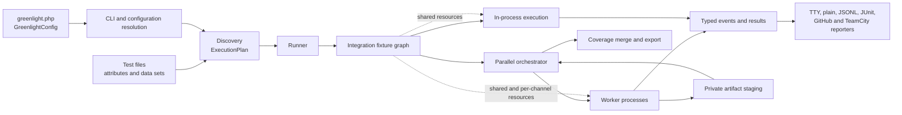

# Architecture

Discovery, process control, schedules, recovery, and reports are internal. Test
authors use a small public interface.

This page gives contributors an architecture summary. The user documentation
explains user-visible behavior. The pages in this directory describe module
responsibilities, interfaces, invariants, and machine-readable formats.

## Runtime flow

The CLI resolves the configuration once. Discovery produces an immutable
execution plan. The runner selects in-process execution or process-pool
execution. Both methods emit the same events. Reporters consume the events and
do not access runner state.

For a nonempty plan, the runner provisions integration fixtures before
`RunStarted`. The fixture graph supplies resources to both execution methods.
The runner closes the graph after `RunFinished` or after a run failure.

The orchestrator makes decisions that apply to more than one worker. It
controls assignments, resource capacity, bail, hard timeouts, crash
containment, summary totals, artifact publication, and the final coverage
merge. Workers execute their plan sections in sequence and send each result
immediately.

## Module map

[`deptrac.yaml`](../../deptrac.yaml) defines and enforces the dependency
direction. Directory names identify modules. They do not make every namespace
public.

| Module group | Responsibility | Permitted dependencies |
| --- | --- | --- |
| `Core` | Shared immutable values, events, results, and worker-protocol data | Nothing |
| `Attribute`, `Condition` | User test metadata | `Core` |
| `Test` | Per-test cleanup controls | Nothing |
| `Config` | Public builders and resolved internal configuration | `Core`, `Plugin` |
| `Expect` | Immediate and temporal expectations | `Core`, `Plugin` |
| `Harness`, `Plugin` | Lifecycle scopes and extension interfaces | `Core` |
| `Doubles`, `Sandbox` | Test-author tools that use harness scopes | Lower test-author modules |
| `Discovery` | PHP declaration discovery and execution plans | `Core`, `Attribute` |
| `Capture`, `Coverage` | Bounded output capture and line-coverage values | `Core` |
| `Reporting` | Event consumers and output formats | `Core` |
| `Runner` | Execution, workers, schedules, containment, and artifacts | All engine modules |
| `Cli` | Command entry point, CLI argument parser, configuration resolution, and orchestration | Configuration and engine modules |
| `Documentation` | Build-time validation of documentation examples | Nothing |
| `PhpStan`, `Rector`, `Symfony`, `Laravel`, `Hyperf`, `Psr`, `Psr15`, `Tempest` | Optional adapters for external tools and frameworks | Their Greenlight interfaces and development-only frameworks |

Dependencies point from modules near the bottom of the table to modules near
the top. Modules near the top do not depend on the `Runner` or `Cli` modules.
`Core` **MUST NOT** know about discovery, processes, reporters, or integrations.
Reporters **MUST NOT** control execution. Optional integrations **MUST NOT**
become runtime package dependencies.

## Module interfaces

### Configuration

`GreenlightConfig` and its nested builders are the user interface.
`Configuration` is the resolved internal value for discovery and the runner.
The CLI applies overrides once between these two forms.

### Test authors

Test authors use attributes, `Expect`, sandboxes, doubles, attachments, and
conditions. They can also use the documented harness and plugin interfaces.
These interfaces define PHP signatures, lifecycle rules, and error behavior.

### Execution

Discovery gives an execution plan to the runner. Workers receive plan values
and emit typed events. They do not discover tests again. The in-process and
parallel methods use the same execution behavior.

### Extensions

Plugins use capability interfaces to add lifecycle subscribers, integration
fixtures, retry decisions, harness providers, and expectation extensions.
Orchestrator-side capabilities control run-wide work. Greenlight creates
separate orchestrator-side and worker-side instances from immutable plugin
definitions. Plugins **SHOULD NOT** depend on orchestrator classes or protocol
implementation classes.

### Output

Human reporters control presentation. Each JSONL and coverage JSON format has
a version. The worker protocol is internal. Before you change an output shape,
read [compatibility](compatibility.md).

## Architectural invariants

- PHP 8.4 or later and zero runtime package dependencies.
- Discovery occurs before execution. Workers consume plans and do not scan the
  file system.
- One terminal `TestResult` represents all attempts of one test ID.
- The orchestrator controls the global summary and all resource totals.
- Greenlight contains worker failures. It does not automatically repeat the
  test that stops its process.
- Binary attachment content stays out of event and protocol frames.
- Events and wire values are explicit, typed, and JSON-round-trippable.
- Greenlight enforces the dependency rules in `deptrac.yaml`.

## Architecture references

- [Compatibility and public interfaces](compatibility.md)
- [Worker lifecycle and wire protocol](worker-lifecycle.md)
- [Orchestrator-owned integration fixtures](orchestrator-integration-fixtures.md)
- [Artifact storage](artifacts.md)
- [JSONL reporter schema](jsonl.md)
- [Coverage JSON schema](coverage-json.md)
- [Temporal expectations](temporal-expectations.md)
- [Infection support decision](mutation-testing.md)
- [Code conventions](conventions.md)
- [Documentation PHP examples](documentation-php-examples.md)

If a decision changes an invariant or compatibility promise, update the
applicable page in the same change. This page describes the current
implementation. Do not add temporary proposals to it.
