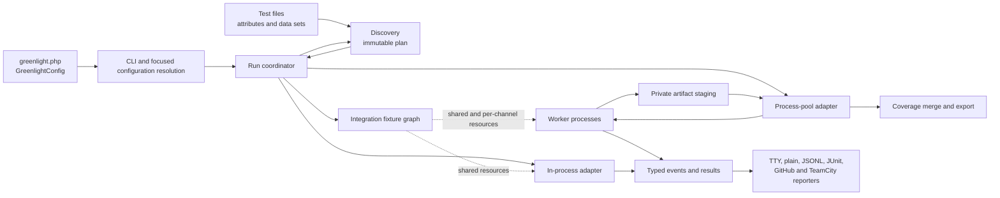

# Architecture

Discovery, process control, schedules, recovery, and reports are internal. Test
authors use a small public interface.

This page gives contributors an architecture summary. The user documentation
explains user-visible behavior. The pages in this directory describe module
responsibilities, interfaces, invariants, and machine-readable formats.

## Runtime flow

The CLI resolves the configuration once and selects one execution adapter.
The run coordinator uses discovery to produce an immutable execution plan.
It controls plan order, run resources, and run lifecycle events. The selected
adapter executes the plan and returns one outcome. Reporters consume the events
and do not access coordinator state.

For a nonempty plan, the coordinator provisions integration fixtures before
`RunStarted`. The fixture graph supplies resources to both adapters. The
coordinator closes the graph after `RunFinished` or after a run failure.

The orchestrator makes decisions that apply to more than one worker. It
controls assignments, resource capacity, bail, hard timeouts, crash
containment, summary totals, artifact publication, and the final coverage
merge. Workers execute their plan sections in sequence and send each result
immediately.

## Module map

[`deptrac.yaml`](../../deptrac.yaml) defines and enforces the dependency
direction. Directory names identify modules. They do not make every namespace
public.

| Module group | Responsibility | Permitted dependencies |
| --- | --- | --- |
| `Internal/Wire`, `Internal/Text`, `Internal/Process`, `Internal/Php` | Worker-protocol operations and focused internal utilities | Nothing |
| `Internal/Filesystem` | Atomic file operations | `Internal/Php` |
| `Artifact` | Attachment values and operations | `Internal/Wire` |
| `Test` | Test definitions, data-provider values, policies, and cleanup controls | `Internal/Wire`, `Internal/Text` |
| `Test/DataSet` | Shared data-set expansion and validation | `Attribute` and focused internal utilities |
| `Condition` | Conditions that control test execution | `Internal/Process` |
| `Result` | Test outcomes, diagnostics, and result values | `Artifact`, `Test`, `Internal/Wire`, `Internal/Text` |
| `Event` | Events that describe the run lifecycle | `Result`, `Test`, `Internal/Wire` |
| `Attribute` | User test metadata | `Condition`, `Test` |
| `Config` | Public builders and focused immutable configuration values | Public contracts, internal utilities, `Plugin` |
| `Expect` | Immediate and temporal expectations | Public contracts, internal PHP utilities, `Plugin` |
| `Harness` | Harness service scopes and resolution | Nothing |
| `IntegrationFixture` | Fixture definitions, resources, provisioning, and cleanup | `Internal/Wire` |
| `Plugin` | Extension interfaces and plugin capability groups | Public contracts, `IntegrationFixture`, and `Reporting` |
| `Doubles`, `Sandbox` | Test-author tools that use harness scopes | Lower test-author modules |
| `Discovery` | PHP declaration discovery, metadata, and caching | Public contracts, `Discovery/Plan`, `Test/DataSet`, internal utilities, and `Attribute` |
| `Discovery/Plan` | Immutable execution plans, ordering, and sharding | `Attribute`, `Test`, and `Internal/Wire` |
| `Coverage` | Line-coverage values and errors | `Internal/Wire` |
| `Coverage/Collection` | Coverage drivers and raw coverage collection | `Coverage` |
| `Coverage/Diff` | Baseline coverage comparison | `Coverage` |
| `Coverage/Export` | Coverage export formats | `Coverage`, `Internal/Text`, and internal PHP utilities |
| `Coverage/Ignore` | Source ignore directives and filtering | `Coverage` and internal PHP utilities |
| `Coverage/Relay` | Coverage transfer from child CLI processes | Coverage modules and internal PHP utilities |
| `Reporting` | Event consumers and output formats | Public contracts and internal PHP utilities |
| `Reporting/Profile` | Profile event aggregation and profile output | `Event` and `Reporting` |
| `Execution/Artifact` | Private attachment staging, publication, recovery, quotas, and cleanup | Artifact, configuration, event, result, test, wire, and internal utilities |
| `Execution/Plugin` | Orchestrator and worker plugin instances and event delivery | Plugin capability modules |
| `Execution/Worker` | In-process test execution, bounded output capture, and worker-owned lifecycle | Test execution modules and execution artifacts |
| `Execution/ProcessPool/Protocol` | Internal worker messages, frames, and socket channels | Wire values and message payload modules |
| `Execution/ProcessPool/Worker` | Hidden worker command and protocol event delivery | Worker, protocol, plugin, and coverage modules |
| `Execution/ProcessPool/Orchestrator` | Process scheduling, resource capacity, containment, and transport | Protocol, worker, artifact, event, result, and coverage modules |
| `Execution` and `Execution/Adapter` | Run coordination and the in-process and process-pool adapters | Execution implementation modules and engine modules through one execution-failure seam |
| `Cli` | Public command entry point and hidden worker routing | `Cli/Command`, `Cli/Output`, coverage relay, and worker execution |
| `Cli/Input`, `Cli/Configuration` | Argument definition and configuration loading | Configuration values and focused internal utilities |
| `Cli/Discovery` | Selection-plan discovery, sharding, and unmatched exclude-path diagnostics | `Cli/Configuration`, configuration values, and `Discovery` |
| `Cli/Output`, `Cli/Reporting`, `Cli/Coverage` | Console output, reporter construction and destinations, and coverage sessions and exports | Their engine modules and focused CLI values |
| `Cli/Signal`, `Cli/State`, `Cli/Watch`, `Cli/WorkerCapacity` | Local runtime adapters and persisted run policy | Focused internal utilities |
| `Cli/Command`, `Cli/Run` | Closed command dispatch and run lifecycle orchestration | Lower CLI modules and engine modules |
| `Documentation` | Build-time validation of documentation examples | Nothing |
| `PhpStan`, `Rector`, `Symfony`, `Laravel`, `Hyperf`, `Psr11`, `Psr15`, `Tempest` | Optional adapters for external tools and frameworks | Their Greenlight interfaces and development-only frameworks |

Dependencies point from modules near the bottom of the table to modules near
the top. Modules near the top do not depend on the `Execution` or `Cli` modules.
Public contract modules **MUST NOT** know about discovery, reporters, or integrations.
Internal utility modules **MUST NOT** depend on public contract modules.
Reporters **MUST NOT** control execution. Optional integrations **MUST NOT**
become runtime package dependencies.

## Module interfaces

### Configuration

`GreenlightConfig` and its nested builders are the user interface. `build()`
groups validated file settings into discovery, worker, execution, and order
values. The CLI applies command-line overrides and creates a
`ResolvedConfiguration` for one command.

The CLI resolves random order to one `RunOrder`. Discovery, reporting, and
execution use that value. Test selection is a separate value. Discovery uses
it directly, and the runners receive only the configuration values that they
use.

### Test authors

Test authors use attributes, `Expect`, sandboxes, doubles, attachments, and
conditions. They can also use the documented harness and plugin interfaces.
These interfaces define PHP signatures, lifecycle rules, and error behavior.

### Execution

`RunCoordinator` owns discovery, plan order, run IDs, artifacts, orchestrator
plugins, integration fixtures, and run lifecycle events. Its interface accepts
one execution adapter.

`InProcessExecution` and `ProcessPoolExecution` are the two adapters at the
execution seam. Each adapter reports its worker topology and executes a plan.
Workers receive plan values and emit typed events. They do not discover tests
again.

### Extensions

Plugins use capability interfaces to add lifecycle subscribers, integration
fixtures, retry decisions, harness providers, and expectation extensions.
Orchestrator-side capabilities control run-wide work. Greenlight creates
separate orchestrator-side and worker-side instances from immutable plugin
definitions. Plugins **SHOULD NOT** depend on orchestrator classes or protocol
implementation classes.

### Output

Human reporters control presentation. JSONL, coverage JSON, and the test
manifest have versions. The worker protocol is internal. Before you change an
output shape, read [compatibility](compatibility.md).

The internal event codec owns event tags, tagged payload validation, and event
construction. It also owns JSONL encoding and decoding. The worker protocol,
JSONL reporter, and `profile:report` use this codec through their own seams.

## Architectural invariants

- PHP 8.4 or later and zero runtime package dependencies.
- Discovery occurs before execution. Workers consume plans and do not scan the
  file system.
- The run coordinator owns `RunStarted` and `RunFinished` for each execution
  adapter.
- One terminal `TestResult` represents all attempts of one test ID.
- The orchestrator controls the global summary and all resource totals.
- Greenlight contains worker failures. It does not automatically repeat the
  test that stops its process.
- Binary attachment content stays out of event and protocol frames.
- Events and wire values are explicit, typed, and JSON-round-trippable.
- One internal event codec owns all machine-event encoding and decoding.
- Greenlight enforces the dependency rules in `deptrac.yaml`.

## Architecture references

- [Compatibility and public interfaces](compatibility.md)
- [Worker lifecycle and wire protocol](worker-lifecycle.md)
- [Orchestrator-owned integration fixtures](orchestrator-integration-fixtures.md)
- [Artifact storage](artifacts.md)
- [JSONL reporter schema](jsonl.md)
- [Test discovery manifest](test-manifest.md)
- [Coverage JSON schema](coverage-json.md)
- [Temporal expectations](temporal-expectations.md)
- [Infection support decision](mutation-testing.md)
- [Code conventions](conventions.md)
- [Documentation PHP examples](documentation-php-examples.md)

If a decision changes an invariant or compatibility promise, update the
applicable page in the same change. This page describes the current
implementation. Do not add temporary proposals to it.
