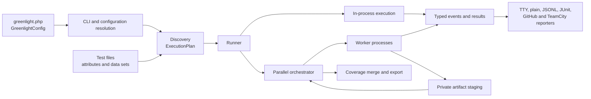

# Architecture

Greenlight is a parallel-first PHP test runner with no runtime package
dependencies. Deep modules contain discovery, process control, schedules,
recovery, and reports. Thus, the interface for test authors stays small.

This page gives contributors an architecture summary. The user documentation
explains user-visible behavior. The pages in this directory explain module
seams, invariants, and machine-readable formats.

## Runtime flow

The CLI resolves the configuration once. Discovery produces an immutable
execution plan. The runner selects in-process execution or process-pool
execution. Both paths emit the same event model. Reporters consume events and
do not access runner state.

The orchestrator controls all decisions that affect more than one worker. These
decisions include assignments, resource capacity, bail, hard timeouts, and
crash containment. They also include summary totals, artifact publication, and
the final coverage merge. Workers execute their plan sections in sequence and
send each result immediately.

## Module map

[`deptrac.yaml`](../../deptrac.yaml) defines and enforces the dependency
direction. Directory names identify modules. They do not make every namespace
public.

| Module group | Responsibility | Permitted dependencies |
| --- | --- | --- |
| `Core` | Shared immutable values, events, results, wire primitives | Nothing |
| `Attribute`, `Condition` | User test metadata | `Core` |
| `Config` | Public builders and resolved internal configuration | `Core`, `Plugin` |
| `Expect` | Immediate and temporal expectations | `Core`, `Plugin` |
| `Harness`, `Plugin` | Lifecycle scopes and extension interfaces | `Core` |
| `Doubles`, `Fixture` | Test-author tools that use harness scopes | Lower test-author modules |
| `Discovery` | PHP declaration discovery and execution plans | `Core`, `Attribute` |
| `Capture`, `Coverage` | Bounded output capture and line-coverage values | `Core` |
| `Reporting` | Event consumers and output formats | `Core` |
| `Runner` | Execution, workers, schedules, containment, artifacts | All engine modules |
| `Cli` | Process edge, argument parse, orchestration, commands | Configuration and engine modules |
| `PhpStan`, `Symfony` | Optional adapters at external seams | Their narrow Greenlight interfaces and development-only frameworks |

Dependencies first point toward values and test-author interfaces. They then
point through the runner and CLI. `Core` **MUST NOT** know about discovery,
processes, reporters, or integrations. Reporters **MUST NOT** control execution.
Optional integrations **MUST NOT** become runtime package dependencies.

## Important seams

### Configuration

`GreenlightConfig` and its nested builders are the user interface.
`Configuration` is the resolved internal value for discovery and the runner.
The CLI applies overrides once between these two forms.

### Test authors

Attributes, `Expect`, fixtures, doubles, attachments, conditions, and
documented harness and plugin interfaces form the test-author seam. The
interface defines lifecycle and error semantics in addition to PHP signatures.

### Execution

The execution plan is the seam between discovery and execution. Workers receive
plan values and emit typed events. They do not rediscover tests. The in-process
and parallel paths adapt the same execution behavior.

### Extensions

Plugins add lifecycle subscribers, retry decisions, harness providers, and
expectation extensions through narrow interfaces. Each worker runs the plugin
implementations. Plugins **SHOULD NOT** depend on orchestrator classes or
protocol implementation classes.

### Output

Human reporters control presentation. Each JSONL and coverage JSON external
interface has a version. The worker protocol is internal. Before you change an
output shape, read [compatibility](compatibility.md).

## Architectural invariants

- PHP 8.4 or later and zero runtime package dependencies.
- Discovery occurs before execution. Workers consume plans and do not scan the
  file system.
- One terminal `TestResult` represents all attempts of one test ID.
- The orchestrator controls the global summary and all resource totals.
- Greenlight contains worker failures. It does not automatically repeat the
  test that stops its process.
- Binary attachment content stays out of event and protocol frames.
- Events and wire values are explicit, typed, and JSON-round-trippable.
- Greenlight enforces the dependency rules in `deptrac.yaml`.

## Architecture references

- [Compatibility and public interfaces](compatibility.md)
- [Worker lifecycle and wire protocol](worker-lifecycle.md)
- [Artifact storage](artifacts.md)
- [JSONL reporter schema](jsonl.md)
- [Coverage JSON schema](coverage-json.md)
- [Temporal expectations](temporal-expectations.md)
- [Infection support decision](mutation-testing.md)
- [Code conventions](conventions.md)

If a decision changes an invariant or compatibility promise, update the
applicable page in the same change. Do not keep a time-limited proposal here as
a description of the current implementation.
