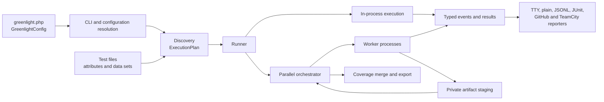

# Architecture

Greenlight is a parallel-first PHP test runner with no runtime package
dependencies. Its architecture keeps the test-authoring interface small while
hiding discovery, process management, scheduling, recovery, and reporting
inside deeper modules.

This page is the starting point for contributors. User-facing behaviour belongs
in the main documentation; the pages in this directory explain implementation
seams, invariants, and machine-readable formats.

## Runtime flow

The CLI resolves configuration once, discovery produces an immutable execution
plan, and the runner selects in-process or process-pool execution. Both
execution paths emit the same event model. Reporters consume events rather than
reaching into runner state.

The orchestrator owns all cross-worker decisions: assignment, resource
capacity, bail, hard timeouts, crash containment, summary accounting, artifact
publication, and final coverage merge. Workers execute assigned plan slices
serially and stream results as they happen.

## Module map

The enforced dependency direction is defined in
[`deptrac.yaml`](../../deptrac.yaml). Directory names are modules, not a promise
that every namespace is public.

| Module group | Responsibility | May depend on |
| --- | --- | --- |
| `Core` | Shared immutable values, events, results, wire primitives | Nothing |
| `Attribute`, `Condition` | Test metadata declared by users | `Core` |
| `Config` | Public builders and resolved internal configuration | `Core`, `Plugin` |
| `Expect` | Immediate and temporal expectations | `Core`, `Plugin` |
| `Harness`, `Plugin` | Lifecycle scopes and extension interfaces | `Core` |
| `Doubles`, `Fixture` | Test-authoring tools built on harness scopes | Lower authoring modules |
| `Discovery` | PHP declaration discovery and execution-plan construction | `Core`, `Attribute` |
| `Capture`, `Coverage` | Bounded output capture and line-coverage values | `Core` |
| `Reporting` | Event consumers and output formats | `Core` |
| `Runner` | Execution, workers, scheduling, containment, artifacts | All engine modules |
| `Cli` | Process edge: parsing, orchestration, commands | Configuration and engine modules |
| `PhpStan`, `Symfony` | Optional adapters at external seams | Their narrow Greenlight interfaces and development-only frameworks |

Dependencies point inward toward values and authoring interfaces, then outward
through the runner and CLI. `Core` must not acquire knowledge of discovery,
processes, reporters, or integrations. Reporters must not control execution.
Optional integrations must not become runtime dependencies of the package.

## Important seams

### Configuration

`GreenlightConfig` and its nested builders are the user interface.
`Configuration` is the resolved internal value consumed by discovery and the
runner. CLI overrides are applied once between those two representations.

### Test authoring

Attributes, `Expect`, fixtures, doubles, attachments, conditions, and documented
harness/plugin interfaces form the test-authoring seam. Their interface
includes lifecycle and error semantics, not only PHP signatures.

### Execution

The execution plan is the seam between discovery and execution. Workers receive
plan values and emit typed events; they do not rediscover tests. The in-process
and parallel paths are two adapters for the same execution behaviour.

### Extensions

Plugins contribute lifecycle subscribers, retry decisions, harness providers,
and expectation extensions through narrow interfaces. Plugin implementations
run inside each worker. They should not depend on orchestrator or protocol
implementation classes.

### Output

Human reporters are presentation details. JSONL and coverage JSON are versioned
external interfaces, while the worker protocol is internal. See
[compatibility](compatibility.md) before changing any emitted shape.

## Architectural invariants

- PHP 8.4 or later and zero runtime package dependencies.
- Discovery happens before execution; workers consume plans rather than scan
  the filesystem.
- One terminal `TestResult` represents all attempts of one test id.
- The orchestrator is the authority for global summary and resource accounting.
- Worker failures are contained without automatically re-running the test that
  killed its process.
- Binary attachment content stays out of event and protocol frames.
- Events and wire values are explicit, typed, and JSON-round-trippable.
- Dependency rules in `deptrac.yaml` are executable architecture, not guidance.

## Architecture references

- [Compatibility and public interfaces](compatibility.md)
- [Worker lifecycle and wire protocol](worker-lifecycle.md)
- [Artifact storage](artifacts.md)
- [JSONL reporter schema](jsonl.md)
- [Coverage JSON schema](coverage-json.md)
- [Temporal expectations](temporal-expectations.md)
- [Infection support decision](mutation-testing.md)
- [Code conventions](conventions.md)

When a decision changes an invariant or a compatibility promise, update the
relevant page in the same change. A time-bound design proposal should not be
left here as if it described the current implementation.
