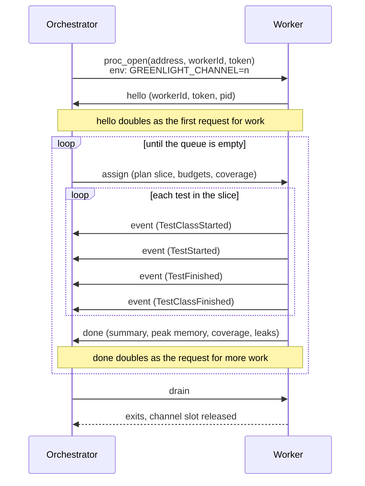
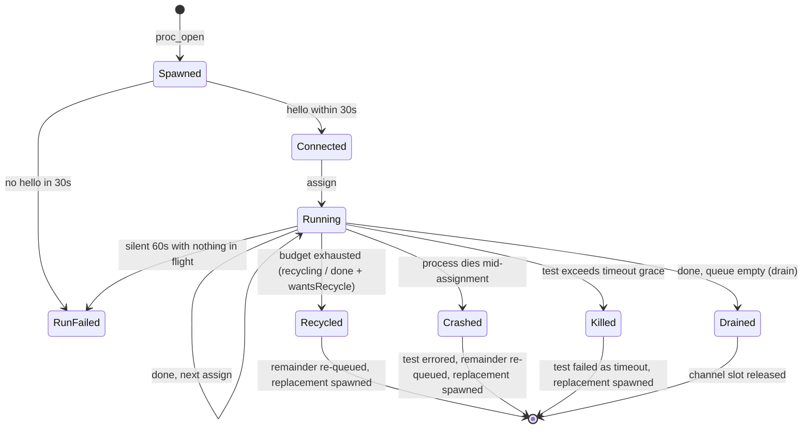

# Worker lifecycle and wire protocol

This document covers the wire traffic between the orchestrator and its workers: how a worker is born, what the two processes say to each other, and every way a worker leaves the pool. It is background reading for contributors and for anyone debugging a parallel run. Nothing here is public API; the protocol is an internal detail and can change between releases.

## The transport

The orchestrator listens on a Unix domain socket in a private temporary directory. If it cannot use a Unix socket, it falls back to TCP on `127.0.0.1` with an ephemeral port. Workers are ordinary child processes started with `proc_open`; each one connects back to that address as a client.

Every message is a length-prefixed JSON frame: a 4-byte big-endian length, then that many bytes of JSON. Frames are capped at 8 MiB, and an oversized or malformed frame is a protocol error, not a warning. The JSON body is an envelope with three fields: a protocol version (`v`, currently `1`), a type tag, and the payload. Unknown versions and unknown tags fail loudly.

The socket is the only data channel. The worker's stdin is closed right after spawn, and its stdout and stderr are drained into a small bounded buffer that the orchestrator only reads when something goes wrong, to attach the worker's last output to a crash report. Test results never travel over stdio, so a test that prints to stdout cannot corrupt the protocol.

## The messages

Seven message types cross the socket:

| Tag | Direction | Payload |
| --- | --- | --- |
| `hello` | worker to orchestrator | worker id, shared token, pid |
| `assign` | orchestrator to worker | a plan slice (test classes to run), recycle budgets, coverage settings, config file path, leak detection flag, result policy |
| `event` | worker to orchestrator | one test event: class started, test started, test finished, class finished |
| `done` | worker to orchestrator | result summary, peak memory, coverage, detected leaks, optional recycle request |
| `recycling` | worker to orchestrator | recycle reason, the tests it did not run, partial coverage |
| `drain` | orchestrator to worker | none; asks the worker to exit cleanly |
| `fatal` | worker to orchestrator | details of a throwable the worker could not contain |

The token in `hello` is 16 random bytes generated per run and passed to each worker on its command line. A connection that presents the wrong token is rejected, so a stray process cannot join the pool and submit results.

## A worker's life, on the wire

The normal flow looks like this:

Some notes on that exchange:

- There is no separate "give me work" message. The pull model rides on `hello` and `done`: the orchestrator reacts to each by assigning the next queued class, so a worker asks for more work simply by finishing what it has.

- The worker bootstraps once, on its first `assign`. Plugins and harness registries are built then and reused for every later assignment, which is why per-run harness services keep worker-lifetime semantics. Per-class state (reflection, hooks, data sets) is rebuilt for each class.
- Events stream one frame per event, the moment they happen. The orchestrator forwards each event to the reporters and updates its running summary as frames arrive, which is what makes live per-worker output and flat orchestrator memory possible. Nothing accumulates worker-side.
- `done` carries the worker's own tally. The orchestrator compares it against the events it counted for that assignment, and a mismatch fails the run. A lost or duplicated frame cannot silently pass a suite.

## Leaving the pool

A worker can leave the pool in several ways, and the orchestrator handles each one differently.

**Recycling.** Recycle budgets (a test count, a memory ceiling, or both) travel inside `assign`, and the worker checks them after every test. When a budget runs out mid-assignment, the worker sends `recycling` with the list of tests it never reached, then exits. When the budget runs out exactly at an assignment boundary, it sets a recycle flag on `done` instead. Either way the orchestrator re-queues the remainder, spawns a replacement, and emits a `WorkerRecycled` event so reporters can show it. Recycling is off by default; both budgets are opt-in configuration.

**Crashes.** If the worker process dies mid-assignment, whatever test was in flight is reported as errored, with the tail of the worker's captured stderr attached to the failure. The rest of the assignment goes back on the queue for a replacement. The crashed test itself is deliberately not re-queued: a test that kills its process would otherwise crash every replacement in turn.

**Hangs.** Each test's timeout is enforced orchestrator-side with a grace window on top (twice the budget plus two seconds), because the worker may be too wedged to enforce anything itself. Past the grace window the orchestrator kills the process with SIGKILL and treats it like a crash, except the test is reported as a timeout failure.

**Fatal errors.** A worker that catches an error it cannot recover from sends `fatal` with the throwable's details before exiting, which gives the orchestrator a real message to report instead of a bare dead process.

Two situations fail the whole run rather than triggering containment, on the theory that a broken environment should be loud: a spawned worker that never says `hello` within 30 seconds, and a connected worker that goes silent for 60 seconds with no test in flight. Both point at something outside the suite (a broken bootstrap, a blocked socket), and re-spawning would loop forever. There is also a spawn budget across the whole run; if replacements keep dying, the run fails with a diagnosis instead of respawning indefinitely.

Workers ignore SIGINT. When you press Ctrl+C, the orchestrator receives the signal and drives an orderly drain, so results already earned are still reported.

## Isolated tests

`#[Isolated]` entries are queued separately and follow a stricter rule: only a fresh worker, one that has not yet run anything, may take one, and only once the pooled queue is empty. After the isolated assignment's `done`, the orchestrator sends `drain` and lets the process exit rather than returning it to the pool. Whatever global state the test mutated dies with the worker.

## Channel numbers

Every worker carries a channel number in the `GREENLIGHT_CHANNEL` environment variable, allocated from a fixed pool of `1` to the configured worker count. The allocator always hands out the lowest free number and gets each number back when a worker retires, so a replacement inherits a released slot. However many processes a long run spawns in total, at most `workerCount` channels are ever live at once, and no two concurrent tests share one. That guarantee is what makes per-channel databases, port ranges, and temp directories safe to key on; see the [README](../../README.md) section on stable resource channels for the user-facing side.
