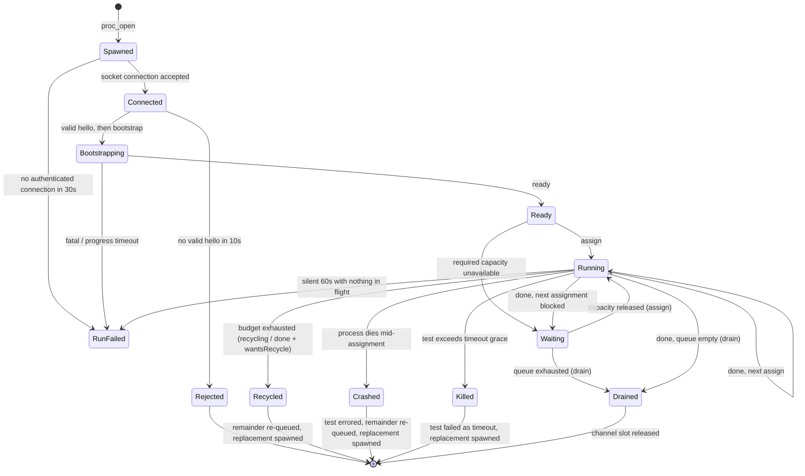

# Worker lifecycle and wire protocol

Greenlight's orchestrator and workers exchange framed JSON messages over a
local socket. The protocol is internal and may change between releases. Its
details are useful when debugging parallel runs.

## The transport

The orchestrator first tries to listen on a Unix domain socket in a private
temporary directory. If that fails, it opens an ephemeral TCP port on
`127.0.0.1`. Greenlight starts each worker with `proc_open`, and the worker
connects back as a client.

Each message is a length-prefixed JSON frame: a 4-byte big-endian length
followed by the JSON body. Frames are capped at 8 MiB. Greenlight rejects
oversized or malformed frames as protocol errors. The JSON envelope contains a
protocol version (`v`, currently `2`), a type tag, and the payload. Greenlight
also rejects unknown versions and tags.

The socket carries all protocol data. Greenlight closes the worker's stdin after
spawn and drains stdout and stderr into a small bounded buffer. The orchestrator
attaches the buffered output to a crash report when something goes wrong. Test
results never travel over stdio, so test output cannot corrupt the protocol.

## The messages

Ten message types cross the socket:

| Tag | Direction | Payload |
| --- | --- | --- |
| `hello` | worker to orchestrator | worker ID, shared token, process ID |
| `bootstrap` | orchestrator to worker | stable channel, config file path, that channel's integration resources |
| `ready` | worker to orchestrator | bootstrap acknowledgement |
| `assign` | orchestrator to worker | a plan slice (test classes to run), recycle budgets, remaining failure allowance, coverage settings, leak detection flag, result policy, artifact session and limits |
| `event` | worker to orchestrator | one test event: class started, test started, test finished, class finished |
| `attempt-started` | worker to orchestrator | active test ID and attempt number for a crash report |
| `done` | worker to orchestrator | result summary, peak memory, coverage, detected leaks, optional recycle request |
| `recycling` | worker to orchestrator | recycle reason, tests that did not run, result summary, partial coverage |
| `drain` | orchestrator to worker | no payload (request for a clean worker exit) |
| `fatal` | worker to orchestrator | details of a throwable that the worker could not contain |

The orchestrator generates a 16-byte random token for each run and passes it to
workers on the command line. A connection with the wrong token cannot join the
pool or submit results.

## Worker startup and assignment

```mermaid
sequenceDiagram
    participant O as Orchestrator
    participant W as Worker

    O->>W: proc_open(address, workerId, token)<br/>env: GREENLIGHT_CHANNEL=n
    W->>O: hello (workerId, token, pid)
    O->>W: bootstrap (channel, config, resources)
    W->>W: load plugins, run worker bootstrap,<br/>build harness registry
    W->>O: ready
    Note over O,W: initial workers all become ready<br/>before any assignment begins

    loop until the queue is empty
        opt required resource capacity is unavailable
            Note over O,W: worker stays connected; no frame is sent
        end
        O->>W: assign (plan slice, budgets, coverage)
        loop each test in the slice
            W->>O: event (TestClassStarted)
            W->>O: event (TestStarted)
            W->>O: event (TestFinished)
            W->>O: event (TestClassFinished)
        end
        W->>O: done (summary, peak memory, coverage, leaks)
        Note over O,W: done doubles as the request for more work
    end

    O->>W: drain
    W-->>O: exits, channel slot released
```

### Assignment rules

`ready` and `done` act as work requests. The orchestrator assigns work when a
worker becomes ready and whenever it finishes an assignment.

The orchestrator records worker timing only at protocol and scheduler
transitions. It records these lifecycle phases:

* process spawn to observed `hello`
* observed `hello` to observed `ready`, which includes worker bootstrap
* observed `ready` to the first sent `assign`
* observed `done` to the next sent `assign`
* a retirement request to observed process exit

The orchestrator also attributes idle time to the initial ready barrier,
resource capacity, or no queued work. It does not add instrumentation to a
worker test loop or a scheduler polling loop.

The initial ready barrier prevents tests from starting while another initial
worker is still bootstrapping. A replacement worker created after a crash or
recycle needs to complete only its own bootstrap.

Workers build their plugins and harness registries during `bootstrap` and reuse
them for later assignments. Per-run harness services therefore live for the
physical worker's lifetime. Workers rebuild per-class reflection, hooks, and
data sets for each class.

The default scheduling unit contains the selected non-isolated tests from one
class. `#[AllowParallel]` changes each selected test or data set into a pooled
one-entry scheduling unit.

The orchestrator keeps these units in execution-plan order. It assigns them to
workers by capacity, so their completion events can have a different order.

Each split unit opens and closes its own class context. It emits one
`TestClassStarted` and `TestClassFinished` pair.

These pairs can overlap for one class. Reporters MUST combine or separate them
without loss of test results.

Greenlight has no class hooks. `#[Before]` and `#[After]` are test hooks, so
their lifecycle does not change for a split class.

A split class cannot use a per-class harness service. A service request causes
a contained test error with corrective guidance.

Data providers run during discovery. A worker also runs the applicable
provider when it resolves arguments for a split entry.

The provider MUST be pure and deterministic. The execution-plan keys detect a
provider result that changes between discovery and execution.

When a previous run supplies class durations, the orchestrator can put adjacent
small classes in one assignment. Each batch has a maximum predicted duration of
50 ms and a maximum of 16 classes. Each adjacent group with the same resource
set keeps at least one pooled unit for each requested worker. Batching does not
change the class order or seed. A run without duration data keeps one pooled
unit for each class. Greenlight does not batch a class that contains an
`#[AllowParallel]` entry.

Each channel's integration resource catalog is capped at 1 MiB, below the
general frame limit. Greenlight sends it through the authenticated local socket,
not through environment variables or command arguments.

Workers send one frame as each event occurs. The orchestrator forwards events
to reporters and updates its running summary as frames arrive. This keeps live
worker output responsive without accumulating results in workers.

Attachment content uses the shared run-scoped filesystem rather than the
socket. Workers send only metadata in `TestFinished`. The orchestrator
publishes staged files before forwarding the event, keeping binary content
outside the 8 MiB frame limit. Atomic sidecars let it recover completed
attachments if a worker crashes. See [artifact storage](artifacts.md).

`done` carries the worker's tally for the assignment. The orchestrator compares
it with the events it counted and fails the run on a mismatch. A lost or
duplicated frame cannot silently pass a suite.

The assignment includes the remaining failure allowance. A worker stops its
batch locally when it uses that allowance. The orchestrator also drains all
workers when the run reaches the limit.

A retried test still produces one `test-started` event and one `test-finished`
event. Attempts are not separate public events. The internal `attempt-started`
frame lets the orchestrator report the correct attempt count after a worker
crash. It uses this frame when a worker dies before `test-finished`.

## Resource assignment

Discovery stores `#[RequiresResource]` names in test metadata. The orchestrator
groups non-isolated entries by class and combines their requirements.

It treats each `#[AllowParallel]` entry as a separate pooled scheduling unit.
It treats each isolated entry as a separate isolated scheduling unit.
It can batch small classes only when their combined resource sets are
identical. It does not batch a class that contains an isolated or
`#[AllowParallel]` entry.

Before it sends `assign`, the orchestrator claims one slot from each required
resource in one atomic operation. A resource without a configured limit has one
slot. The assignment retains its slots until it finishes. The orchestrator also
releases the slots if the worker recycles, crashes, reaches a timeout, or does
not receive the assignment. Retries remain in the same assignment and retain
the slots.

If the oldest unit waits, the orchestrator reserves one slot from each required
resource. A later unit can pass it only in one of these conditions:

* The later unit uses other resources.
* Capacity exists beyond the reservation.

Unrelated work can continue. It cannot delay the oldest unit indefinitely.

The orchestrator sends no message to a connected worker while the worker waits
for resource capacity. It records this state separately from an active
assignment. Thus, the normal progress deadline does not classify the worker as
stalled. After capacity becomes available, the orchestrator checks the workers
that wait for resources.

The orchestrator claims resource capacity from the test metadata in `assign`,
without another protocol message. Each Greenlight process, worktree, or shard
has separate resource counters. Different runs require an external lock or
service for coordination.

The orchestrator controls capacity, not resource identity. A limit of two
permits two assignments that require the resource at the same time. It does not
tell either assignment which database, account, or sandbox to use.

## Leaving the pool

```mermaid
stateDiagram-v2
    [*] --> Spawned: proc_open
    Spawned --> Connected: socket connection accepted
    Spawned --> RunFailed: no authenticated connection in 30s
    Connected --> Bootstrapping: valid hello, then bootstrap
    Connected --> Rejected: no valid hello in 10s
    Rejected --> [*]
    Bootstrapping --> Ready: ready
    Bootstrapping --> RunFailed: fatal / progress timeout
    Ready --> Running: assign
    Ready --> Waiting: required capacity unavailable
    Waiting --> Running: capacity released (assign)
    Waiting --> Drained: queue exhausted (drain)
    Running --> Running: done, next assign
    Running --> Waiting: done, next assignment blocked
    Running --> Drained: done, queue empty (drain)
    Running --> Recycled: budget exhausted (recycling / done + wantsRecycle)
    Running --> Crashed: process dies mid-assignment
    Running --> Killed: test exceeds timeout grace
    Running --> RunFailed: silent 60s with nothing in flight
    Recycled --> [*]: remainder re-queued, replacement spawned
    Crashed --> [*]: test errored, remainder re-queued, replacement spawned
    Killed --> [*]: test failed as timeout, replacement spawned
    Drained --> [*]: channel slot released
```

### Recycling

Recycle budgets travel inside `assign`, and the worker checks them after every
test. A budget may limit the test count, memory use, or both. When a budget runs
out mid-assignment, the worker sends `recycling` with the tests it did not reach
and then exits. At an assignment boundary, it sets a recycle flag on `done`
instead.

The orchestrator re-queues unfinished tests, spawns a replacement, and emits a
`WorkerRecycled` event. The default memory limit is 256M. Greenlight does not
apply a test-count limit by default.

### Crashes

If a worker dies mid-assignment, the orchestrator reports its in-flight test as
errored and attaches the tail of the worker's stderr. It returns the rest of the
assignment to the queue. It does not re-queue the crashed test because a test
that kills its process would kill each replacement in turn.

### Timeouts

The orchestrator enforces each test timeout with a grace window of twice the
budget plus two seconds. The worker may be too stuck to enforce the timeout
itself. When the grace window expires, the orchestrator kills the process with
SIGKILL and handles it as a crash. It reports the test as timed out.

The worker also gives `eventually()` and `consistently()` the current attempt's
monotonic deadline. Their polling stops at that deadline, but a probe can still
block. The orchestrator's grace window remains the hard limit.

### Fatal errors

A worker sends `fatal` with the throwable's details when it catches an error it
cannot recover from. The orchestrator can then report the error instead of a
bare process exit.

### Run failures

A worker must connect and authenticate within 30 seconds after process
creation. After the server accepts a socket, that socket has 10 seconds to
send a valid `hello` message. The server closes a connection that misses this
authentication deadline.

The orchestrator also fails the run when an authenticated worker has no
progress for 60 seconds without a test in flight. These failures usually show
a broken bootstrap or blocked socket. The orchestrator does not start another
worker that is likely to fail in the same way.

A run-wide spawn budget prevents an endless replacement loop. If the pool
exceeds that budget, the orchestrator fails the run with a diagnostic.

### Signals

When the orchestrator receives its first SIGINT or SIGTERM, it drains workers,
emits the partial result, and then tears down integration fixtures. Workers
ignore terminal SIGINT so the orchestrator controls that sequence. A test that
is polling can finish like any other test in flight. A second signal restores
the operating system's default immediate termination behavior.

## Isolated tests

The orchestrator queues `#[Isolated]` entries separately. Only a fresh worker
may take an isolated entry, and only after the pooled queue is empty. After
`done`, the orchestrator sends `drain` and lets the process exit instead of
returning it to the pool. Any global state changed by the test dies with the
worker. An isolated entry still waits for its required resources.

`#[AllowParallel]` and `#[Isolated]` express incompatible process ownership.
Discovery rejects a class that combines them.

## Split classes

`#[AllowParallel]` changes scheduling granularity. It does not change plan
creation, selection, seeds, retry rules, timeout rules, or result identities.

The orchestrator applies resource limits and crash containment to each split
unit. A worker crash affects only the active test because a split unit has one
entry.

With one worker, the attribute does not create concurrency. Parallel execution
always uses worker processes. Greenlight does not use Fibers for this feature.

## Channel numbers

Every worker receives a channel number in the `GREENLIGHT_CHANNEL` environment
variable. The channel pool runs from `1` to the configured worker count. The
allocator gives out the lowest free number and returns it to the pool when a
worker retires, so a replacement inherits a released slot.

At most `workerCount` channels are live at once, and concurrent tests never
share one. Per-channel databases, port ranges, and temporary directories can
therefore use the number safely. The [README](../../README.md) describes the
user-facing contract.

Integration fixtures use the same channel pool. Greenlight merges shared values
with the allocated channel overlay before bootstrap, so a worker never receives
another channel's resource catalog. Fresh workers running isolated tests draw
from the same pool and receive the resources for their assigned channel.
