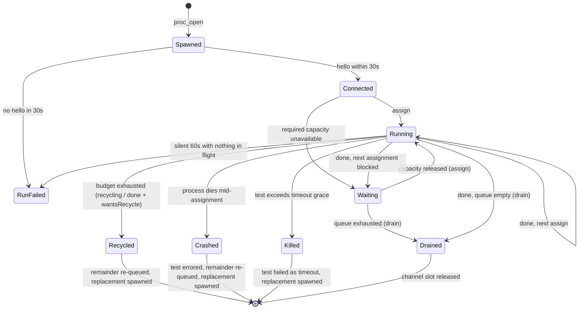

# Worker lifecycle and worker protocol

This document describes how the orchestrator creates workers and communicates
with them. It also describes all worker exit paths. Contributors can use this
information to analyze a parallel run. The worker protocol is an internal
implementation detail. It is not public API and can change between releases.

## Transport

The orchestrator listens on a Unix domain socket in a private temporary
directory. If the Unix socket is unavailable, the orchestrator uses TCP on
`127.0.0.1` with an ephemeral port. The orchestrator starts each worker with
`proc_open`. Each worker connects to the address as a client.

Each message has a four-byte length prefix and a JSON body. The prefix contains
the JSON byte count in big-endian order. The protocol limits each frame to
8 MiB. It treats an oversized or malformed frame as a protocol error.

The JSON body is an envelope with three fields:

- The protocol version in `v`, currently `1`
- A message tag
- The payload

A receiver rejects an unknown protocol version or message tag.

The socket is the only protocol channel. Attachment content uses the shared
run-scoped staging directory that this document describes later. The
orchestrator closes the worker's stdin immediately after process creation. It
continuously reads the worker's stdout and stderr into a small, bounded
diagnostics buffer. The orchestrator reports this buffer only when it helps to
explain a worker failure.

Test results do not use stdio. Thus, test output cannot corrupt the protocol.

## Messages

Eight message types cross the socket:

| Tag | Direction | Payload |
| --- | --- | --- |
| `hello` | worker to orchestrator | worker ID, shared token, process ID |
| `assign` | orchestrator to worker | an assignment, recycle limits, coverage settings, configuration file path, leak detection flag, result policy, artifact session and limits |
| `event` | worker to orchestrator | one test event: class started, test started, test finished, class finished |
| `attempt-started` | worker to orchestrator | active test ID and attempt number for a crash report |
| `done` | worker to orchestrator | result summary, peak memory, coverage, detected leaks, optional recycle request |
| `recycling` | worker to orchestrator | recycle reason, tests that did not run, result summary, partial coverage |
| `drain` | orchestrator to worker | no payload (request for a clean worker exit) |
| `fatal` | worker to orchestrator | details of a throwable that the worker could not contain |

The orchestrator generates a 16-byte random token for each run. It passes the
token to each worker on the command line. The orchestrator rejects a connection
that presents the wrong token. Thus, an unrelated process cannot join the
worker pool or submit results.

## Worker protocol sequence

The normal sequence is:

```mermaid
sequenceDiagram
    participant O as Orchestrator
    participant W as Worker

    O->>W: proc_open(address, workerId, token)<br/>env: GREENLIGHT_CHANNEL=n
    W->>O: hello (workerId, token, pid)
    Note over O,W: hello doubles as the first request for work

    loop until the queue is empty
        opt required resource capacity is unavailable
            Note over O,W: worker stays connected; no frame is sent
        end
        O->>W: assign (plan slice, budgets, coverage)
        loop each test in the slice
            W->>O: event (TestClassStarted)
            W->>O: event (TestStarted)
            W->>O: event (TestFinished)
            W->>O: event (TestClassFinished)
        end
        W->>O: done (summary, peak memory, coverage, leaks)
        Note over O,W: done doubles as the request for more work
    end

    O->>W: drain
    W-->>O: exits, channel slot released
```

There is no separate work-request message. The `hello` and `done` messages are
work requests. After each request, the orchestrator assigns the next queued
class when one is available. Thus, each worker requests more work after it
completes an assignment.

The worker initializes once when it receives its first `assign` message. It
builds the plugin and harness registries at that time. It reuses those
registries for all subsequent assignments. Consequently, per-run harness
services have worker-lifetime semantics. The worker recreates reflection data,
hooks, and data sets for each test class.

The worker sends one frame immediately for each event. The orchestrator sends
each event to the reporters and updates the run summary. This sequence permits
live per-worker output. It also keeps orchestrator memory use flat. The
worker does not accumulate events.

A retried test still produces one `test-started` event and one `test-finished`
event. Attempts are not separate public events. The internal `attempt-started`
frame lets the orchestrator report the correct attempt count after a worker
crash. It uses this frame when a worker dies before `test-finished`.

Attachment content uses the shared run-scoped file system, not the socket.
Workers send only metadata in `TestFinished`. The orchestrator publishes staged
files before it sends the event to reporters. This keeps binary content outside
the 8 MiB frame limit. Atomic sidecars let the orchestrator recover complete
attachments after a worker crash. See [artifact storage](artifacts.md).

The `done` and `recycling` messages contain the worker's result counts. The
orchestrator compares these counts with the events for the assignment. A mismatch
fails the run. Thus, a lost or duplicate result frame cannot cause an incorrect
suite success.

## Resource assignment

Discovery stores `#[RequiresResource]` names in test metadata. It groups entries
by class and combines the requirements from all entries in that class. The
orchestrator treats an isolated entry as a separate unit.

Before it sends `assign`, the orchestrator claims one slot from each required
resource in one atomic operation. A resource without a configured limit has one
slot. The assignment retains its slots until it finishes. The orchestrator also
releases the slots if the worker recycles, crashes, reaches a timeout, or does
not receive the assignment. Retries remain in the same assignment and retain
the slots.

If the oldest unit waits, the orchestrator reserves one slot from each required
resource. A later unit can pass it only in one of these conditions:

- The later unit uses other resources.
- Capacity exists beyond the reservation.

Unrelated work can continue. It cannot delay the oldest unit indefinitely.

The orchestrator sends no message to a connected worker while the worker waits
for resource capacity. It records this state separately from an active
assignment. Thus, the normal progress deadline does not classify the worker as
stalled. After capacity becomes available, the orchestrator checks the workers
that wait for resources.

Resource assignment occurs only in the orchestrator. The `assign` message
already contains the test metadata, so resource assignment requires no
additional protocol message. Each Greenlight process, worktree, or shard has
separate resource counters. Different runs require an external lock or service
for coordination.

The orchestrator controls capacity, not resource identity. A limit of two
permits two class assignments that require the resource at the same time. It
does not tell either class which database, account, or sandbox to use.

## Worker exit

A worker can exit the worker pool in these ways:

```mermaid
stateDiagram-v2
    [*] --> Spawned: proc_open
    Spawned --> Connected: hello within 30s
    Spawned --> RunFailed: no hello in 30s
    Connected --> Running: assign
    Connected --> Waiting: required capacity unavailable
    Waiting --> Running: capacity released (assign)
    Waiting --> Drained: queue exhausted (drain)
    Running --> Running: done, next assign
    Running --> Waiting: done, next assignment blocked
    Running --> Drained: done, queue empty (drain)
    Running --> Recycled: budget exhausted (recycling / done + wantsRecycle)
    Running --> Crashed: process dies mid-assignment
    Running --> Killed: test exceeds timeout grace
    Running --> RunFailed: silent 60s with nothing in flight
    Recycled --> [*]: remainder re-queued, replacement spawned
    Crashed --> [*]: test errored, remainder re-queued, replacement spawned
    Killed --> [*]: test failed as timeout, replacement spawned
    Drained --> [*]: channel slot released
```

**Recycle.** An `assign` message contains a test-count limit, a memory limit, or
both. The worker checks these limits after each test. If the worker reaches a
limit during an assignment, it sends `recycling`. This message
identifies the tests that did not run. The worker then exits.

If the worker reaches a limit exactly at an assignment boundary, it
sets a recycle flag on `done`. In both cases, the orchestrator returns the
remainder to the queue and starts a replacement. It also emits a
`WorkerRecycled` event for reporters. The default memory limit is 256M.
Greenlight does not apply a test-count limit by default.

**Crash.** If a test is active when its worker dies, the orchestrator reports
the test as errored. It attaches the tail of the worker's captured stderr to
the failure. The orchestrator returns the rest of the assignment to the queue
for a replacement.

The orchestrator does not return the crashed test to the queue. Otherwise, the
same test can terminate each replacement process. The
orchestrator releases the assignment's resource slots before it returns
untouched entries to the queue.

**Hang.** The orchestrator enforces each test timeout with a grace limit. This
limit is twice the test budget plus two seconds. A blocked worker cannot
reliably enforce its own timeout. At the grace limit, the orchestrator kills
the process with SIGKILL.

The orchestrator reports the test as failed. It includes the elapsed duration
and a timeout failure detail. It recovers staged attachments and returns
untouched tests to the queue. The replacement has the reason value `crash`.
The public recycle-reason enum uses this value for all abnormal worker
terminations.

The worker gives `eventually()` and `consistently()` the monotonic deadline for
the current attempt. These methods stop their polls at that deadline. A probe
can still block. The orchestrator grace limit remains the hard limit.

**Fatal error.** If a worker catches an unrecoverable error, it sends `fatal`
with the throwable details before it exits. This gives the orchestrator an
error message instead of only a dead process.

The orchestrator fails the complete run for either of these conditions:

- A new worker does not send `hello` within 30 seconds.
- A connected worker sends no message for 60 seconds when no test is active.

Both conditions indicate a fault outside the suite, such as an invalid
bootstrap or a blocked socket. Each replacement worker repeats the fault. A
run-wide spawn limit also controls the total number of workers. If replacements
repeatedly die, the orchestrator fails the run with a diagnosis.

Workers ignore SIGINT. Ctrl+C sends the signal to the orchestrator. The
orchestrator performs an orderly drain and reports completed results. It
permits the active test to finish. This rule also applies to a test that polls.

## Isolated tests

The orchestrator puts `#[Isolated]` entries in a separate queue. It assigns an
isolated entry only to a fresh worker after the pooled queue is empty. A fresh
worker has not run a prior test.

After the worker sends `done` for the isolated assignment, the orchestrator
sends `drain`. The worker then exits and does not return to the pool. Global
state changes from the test end with the worker process. An isolated entry still
waits for its required resources before the assignment.

## Channel numbers

Each worker receives a channel number in the `GREENLIGHT_CHANNEL` environment
variable. The orchestrator uses a fixed pool from `1` through the configured
worker count. It supplies the lowest free number and reclaims the number when a
worker retires. A replacement can receive the released channel number.

The number of live channels never exceeds `workerCount`, independent of the
total worker processes in a run. Two concurrent tests never have the same
channel number.

A channel identifies a stable resource slot for one worker. The resource
scheduler controls shared capacity but does not assign resource identity. A
test can use both functions. For example, it can use a channel-specific
database and a concurrency limit for a shared sandbox. For user guidance, see
[channels and resource limits](../configuration.md#channels-and-resource-limits).
